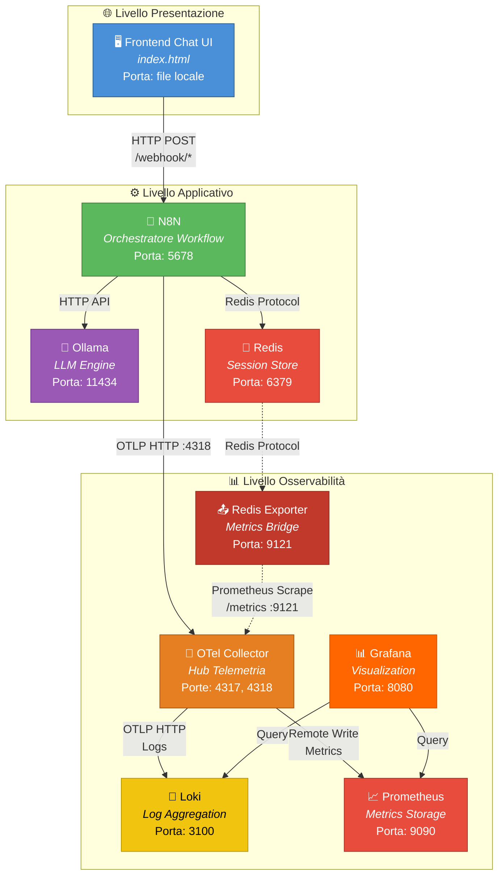
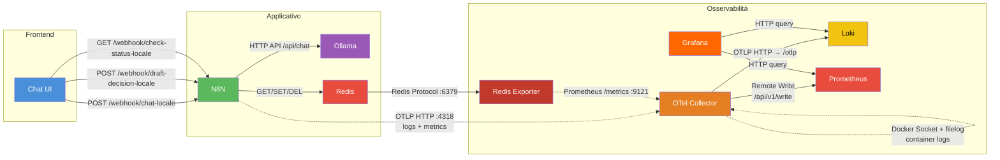
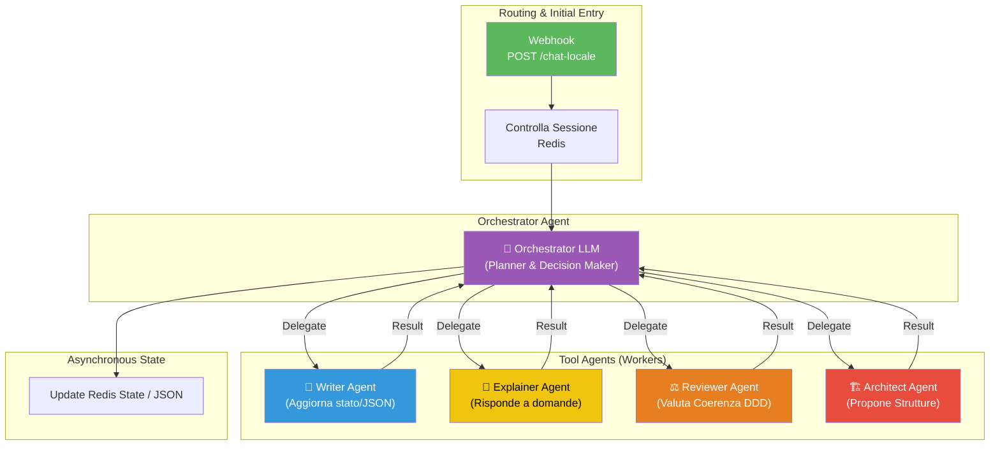
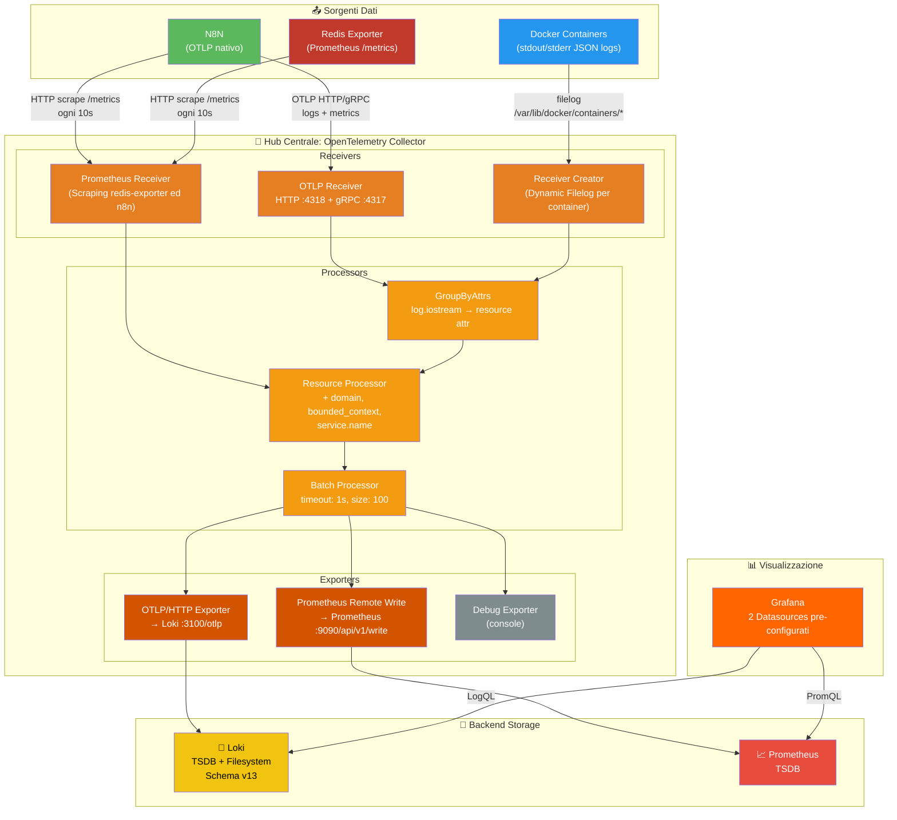
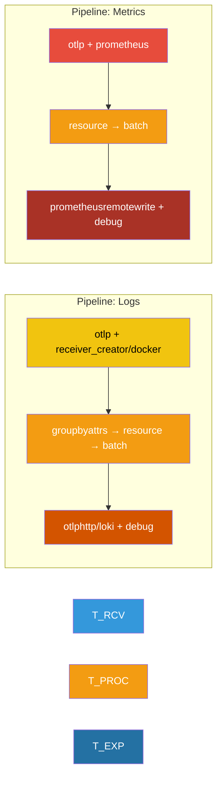
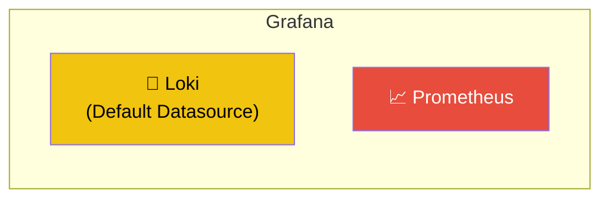

# 🏗️ Agente DDD Interviewer — Architettura a Microservizi

> **Un agente conversazionale basato su LLM che guida l'utente nella modellazione Domain-Driven Design (DDD), con un'infrastruttura a microservizi completamente osservabile.**

Il sistema intervista l'utente per comprendere il suo dominio di business, genera automaticamente un'architettura DDD strutturata (Bounded Contexts, Aggregates, Entities, Value Objects, Domain Events) e permette iterazioni di refinement con un meccanismo di draft/confirm safe-lock.

---

## 📑 Indice

- [Panoramica del Progetto](#-panoramica-del-progetto)
- [Stack Tecnologico](#-stack-tecnologico)
- [Architettura Generale dei Microservizi](#-architettura-generale-dei-microservizi)
- [Comunicazione tra i Microservizi](#-comunicazione-tra-i-microservizi)
- [Pipeline dei Workflow N8N](#-pipeline-dei-workflow-n8n)
- [Stack di Osservabilità](#-stack-di-osservabilità)
  - [Architettura dello Stack](#architettura-dello-stack)
  - [OpenTelemetry Collector (Hub Centrale)](#opentelemetry-collector-hub-centrale)
  - [Raccolta dei Log](#raccolta-dei-log)
  - [Metriche](#metriche)
  - [Correlazione tra Segnali in Grafana](#correlazione-tra-segnali-in-grafana)
- [Frontend Chat UI](#-frontend-chat-ui)
- [Struttura del Progetto](#-struttura-del-progetto)
- [Guida all'Utilizzo](#-guida-allutilizzo)
  - [Prerequisiti](#prerequisiti)
  - [Avvio del Sistema](#avvio-del-sistema)
  - [Configurazione di N8N](#configurazione-di-n8n)
  - [Download del Modello LLM](#download-del-modello-llm)
  - [Utilizzo dell'Agente](#utilizzo-dellagente)
  - [Accesso alla Dashboard di Osservabilità](#accesso-alla-dashboard-di-osservabilità)
  - [Arresto del Sistema](#arresto-del-sistema)
- [Porte Esposte](#-porte-esposte)
- [Licenza](#-licenza)

---

## 🎯 Panoramica del Progetto

Il progetto implementa un **agente conversazionale intelligente** che assiste gli utenti nel processo di **Domain-Driven Design (DDD)**. Il sistema è organizzato come un'architettura a microservizi orchestrata tramite Docker Compose, con tre macro-aree funzionali:

1. **Livello Applicativo** — N8N (orchestrazione workflow), Ollama (inferenza LLM), Redis (stato sessione)
2. **Livello Presentazione** — Frontend HTML/JS con interfaccia chat
3. **Livello Osservabilità** — Stack completo con OpenTelemetry, Loki, Prometheus e Grafana

L'agente opera in **tre fasi principali**:
- **Discovery**: intervista guidata per estrarre il dominio di business e generare un'architettura DDD in formato JSON
- **Refinement**: l'utente può chiedere spiegazioni o proporre modifiche all'architettura generata
- **Draft Decision**: meccanismo safe-lock per confermare o rifiutare le modifiche proposte

---

## 🛠️ Stack Tecnologico

| Componente | Tecnologia | Versione | Ruolo |
|---|---|---|---|
| **Orchestratore Workflow** | N8N | latest | Gestione pipeline agente multi-step |
| **LLM Engine** | Ollama | latest | Inferenza modelli linguistici locali |
| **Session Store** | Redis | Alpine | Stato sessione, chat history, JSON architettura |
| **Metrics Exporter** | Redis Exporter | latest | Esposizione metriche Redis in formato Prometheus |
| **Telemetry Hub** | OpenTelemetry Collector Contrib | 0.133.0 | Raccolta centralizzata logs, metriche |
| **Log Aggregation** | Grafana Loki | 3.5.0 | Storage e query dei log |
| **Metrics Storage** | Prometheus | 2.53.0 | Storage metriche time-series |
| **Visualization** | Grafana | 12.2 | Dashboard, alerting, correlazione segnali |
| **Frontend** | HTML/CSS/JS | — | Interfaccia chat utente |

---

## 🏛️ Architettura Generale dei Microservizi

Il sistema è composto da **8 container Docker** interconnessi su una singola rete bridge (`rete_unica`). L'architettura segue una separazione netta tra servizi applicativi e servizi di osservabilità.



### Rete Docker

Tutti i servizi comunicano su un'unica rete bridge Docker:

```yaml
networks:
  rete_unica:
    driver: bridge
    name: rete_unica
```

Questo permette la risoluzione DNS automatica tra i container tramite il nome del servizio (es. `redis:6379`, `ollama:11434`, `loki:3100`).

---

## 🔗 Comunicazione tra i Microservizi

La comunicazione tra i microservizi utilizza diversi protocolli in base al tipo di interazione. Il diagramma seguente mostra tutti i flussi di comunicazione con i relativi protocolli:



### Tabella Riepilogativa dei Protocolli

| Sorgente | Destinazione | Protocollo | Porta | Descrizione |
|---|---|---|---|---|
| Frontend | N8N | HTTP REST | 5678 | Webhook per messaggi chat, decisioni draft, polling status |
| N8N | Ollama | HTTP API | 11434 | Chiamate LLM per generazione/analisi DDD |
| N8N | Redis | Redis Protocol | 6379 | Lettura/scrittura stato sessione, chat history, JSON |
| N8N | OTel Collector | OTLP HTTP | 4318 | Telemetria strutturata (logs, metrics) |
| Redis | Redis Exporter | Redis Protocol | 6379 | Scraping metriche Redis |
| Redis Exporter | OTel Collector | Prometheus HTTP | 9121 | Endpoint `/metrics` scraping ogni 10s |
| OTel Collector | Loki | OTLP HTTP | 3100 | Log di tutti i container + log strutturati N8N |
| OTel Collector | Prometheus | Remote Write | 9090 | Metriche via `/api/v1/write` |
| Grafana | Loki, Prom | HTTP | varie | Query per visualizzazione e correlazione |

---

## 🔄 Pipeline dei Workflow N8N

Il sistema utilizza un'architettura **Orchestrator-Workers**, implementata attraverso workflow N8N interconnessi. Questa architettura sostituisce una pipeline rigida con un modello agenziale flessibile, dove un orchestratore centrale delega compiti a tool specializzati (Agenti).



### Dettaglio dell'Architettura ad Agenti

L'agente non segue più un flusso lineare fisso (Discovery → Refinement). Il controllo è centralizzato nell'**Orchestrator**, un LLM programmato con prompt di Reflection e Planning.

#### 1. Routing Endpoint
Il **punto d'ingresso** riceve le richieste dal frontend. Gestisce la storia della chat (caricandola da Redis) e passa il contesto aggiornato all'Orchestratore.

#### 2. Orchestrator Agent
Il "cervello" del sistema. Analizza l'input dell'utente e il JSON corrente dell'architettura DDD. Invece di rispondere direttamente, decide quale **Worker Tool** chiamare per svolgere compiti specifici. L'Orchestratore può anche terminare la conversazione per richiedere ulteriori dettagli all'utente.

#### 3. Worker Agents (Tools)
I workflow subordinati richiamati dall'Orchestratore:
- **Writer Agent**: L'unico autorizzato a mutare l'architettura JSON. Riceve le decisioni validate e aggiorna lo stato su Redis.
- **Explainer Agent**: Analizza il JSON corrente e risponde a dubbi o richieste di spiegazioni dell'utente.
- **Reviewer Agent**: Valuta se le modifiche proposte rispettano i principi del Domain-Driven Design o se creano incongruenze.
- **Architect Agent**: Supporta la generazione iniziale o estese mutazioni strutturali dell'architettura.

#### 4. Polling Workflow
Il frontend esegue **polling ogni 3 secondi** su questo endpoint per verificare lo stato delle operazioni asincrone. Il workflow controlla tre chiavi Redis:
- `discovery_json` — risultato dell'architettura corrente
- `draft_json` — bozza di modifica (proposta ma non ancora approvata)
- `draft_status` — stato del draft

#### 5. Draft Decision Workflow
Implementa il meccanismo **safe-lock** per la transizione di stato JSON:
- **Conferma** → il `draft_json` viene promosso a `discovery_json` (l'architettura corrente viene sovrascritta)
- **Rifiuta** → il `draft_json` viene eliminato
In entrambi i casi, la memoria temporanea della sessione di modifica viene cancellata.

---

## 📡 Stack di Osservabilità

Lo stack di osservabilità implementa i **due pilastri dell'osservabilità moderna**: **Logs** e **Metrics**, con aggregazione e visualizzazione in Grafana.

### Architettura dello Stack



### OpenTelemetry Collector (Hub Centrale)

L'**OpenTelemetry Collector Contrib** (`otel/opentelemetry-collector-contrib:0.133.0`) è il cuore dello stack di osservabilità. Agisce come hub centralizzato che riceve, processa e instrada tutti i segnali di telemetria.

#### Extensions
- **Docker Observer** (`docker_observer`): scopre automaticamente tutti i container Docker in esecuzione via Docker socket (`/var/run/docker.sock`). Per ogni container espone: name, container_id, image, port, labels.

#### Receivers (3 sorgenti)

| Receiver | Tipo | Sorgente | Segnali |
|---|---|---|---|
| `otlp` | OTLP HTTP/gRPC | N8N | Logs strutturati + Metrics |
| `receiver_creator/docker` | Dynamic Filelog | Tutti i container Docker | Logs (stdout/stderr) |
| `prometheus` | Prometheus Scraper | Redis Exporter e n8n | Metrics |

Il **Receiver Creator** è particolarmente sofisticato: crea **dinamicamente** un receiver `filelog` per **ogni container** scoperto dal `docker_observer`. La regola `type == "container" && name != "otel-collector"` esclude il collector stesso per evitare feedback loops. Per ogni container, il log path viene risolto dinamicamente:

```
/var/lib/docker/containers/{container_id}/{container_id}-json.log
```

I log Docker in formato JSON (es. `{"log":"...","stream":"stdout","time":"..."}`) vengono parsati con operatori pipeline:
1. **json_parser** — estrae il body del log e il timestamp
2. **move (body)** — sposta `attributes.log` → `body`
3. **move (stream)** — rinomina `attributes.stream` → `attributes["log.iostream"]`

I **resource attributes** (`container.name`, `container.id`, `container.image.name`) vengono iniettati dinamicamente dal Docker Observer, rendendo ogni log filtrabile per container in Grafana.

#### Processors (3 stage pipeline)

| Processor | Funzione |
|---|---|
| `groupbyattrs` | Promuove `log.iostream` da log attribute a **resource attribute** (necessario per Loki) |
| `resource` | Aggiunge attributi DDD statici: `domain=core_domain`, `bounded_context=domain_modeling`, `service.name=agent_1_interviewer` |
| `batch` | Raggruppa i record in batch (timeout 1s, max 100 record) per efficienza di rete |

#### Exporters (4 destinazioni)

| Exporter | Protocollo | Destinazione | Segnali |
|---|---|---|---|
| `otlphttp/loki` | OTLP HTTP | `loki:3100/otlp` | Logs |
| `prometheusremotewrite` | Remote Write | `prometheus:9090/api/v1/write` | Metrics |
| `debug` | Console | stdout | Tutti (debug) |

#### Pipelines del Collector



### Raccolta dei Log

Loki riceve i log dall'OTel Collector e li indicizza con **label OTLP**. La configurazione `otlp_config` in Loki definisce quali resource attributes vengono promossi a label indicizzate:

| Label | Sorgente | Descrizione |
|---|---|---|
| `service_name` | OTel resource processor | Nome del servizio (`agent_1_interviewer`) |
| `container_name` | Docker Observer | Nome leggibile del container (es. `agente_interviewer_n8n`) |
| `container_id` | Docker Observer | ID del container Docker |
| `container_image_name` | Docker Observer | Immagine Docker (es. `docker.n8n.io/n8nio/n8n`) |
| `log_iostream` | GroupByAttrs processor | Stream del log (`stdout` / `stderr`) |
| `domain` | OTel resource processor | Dominio DDD (`core_domain`) |
| `bounded_context` | OTel resource processor | Bounded Context (`domain_modeling`) |

Loki è configurato con:
- **Schema TSDB v13** per indexing efficiente
- **Retenzione**: reject log più vecchi di 7 giorni
- **Rate limiting**: 10 MB/s ingestion rate per tenant
- **Compactor**: ottimizza lo storage ogni 10 minuti

### Metriche

Le metriche arrivano a Prometheus attraverso tre canali:
1. **OTLP da N8N** → OTel Collector → Prometheus Remote Write
2. **Scraping N8N** → N8N Endpoint `/metrics` (:5678) → OTel Collector (Prometheus receiver) → Prometheus Remote Write
3. **Scraping Redis** → Redis Exporter (:9121) → OTel Collector (Prometheus receiver) → Prometheus Remote Write

> **Nota**: Prometheus è configurato esclusivamente in modalità **Remote Write receiver** (`--web.enable-remote-write-receiver`). Non esegue scraping diretto — tutte le metriche transitano per l'OTel Collector.

Il Redis Exporter espone metriche come:
- Connessioni attive e totali
- Memoria utilizzata
- Operazioni al secondo
- Keyspace statistics
- Latenza dei comandi

### Grafana

Grafana è pre-configurato con **2 datasource**:



---

## 💬 Frontend Chat UI

Il frontend è una **Single Page Application** (SPA) HTML/CSS/JS che implementa un'interfaccia chat interattiva, servita come file statico locale.

### Funzionalità principali:
- **Chat multi-turn** con l'agente DDD
- **Sessione persistente** via `localStorage` (`sessionId`)
- **Tre modalità di interazione**:
  - **Discovery**: l'agente intervista l'utente
  - **Explain**: l'utente chiede spiegazioni sull'architettura
  - **Modify**: l'utente richiede modifiche strutturali
- **Rendering JSON** con syntax highlighting e pulsante "Copia JSON"
- **Rendering Markdown** per documenti architetturali (tramite `marked.js`)
- **Meccanismo di draft** con bottoni Conferma/Rifiuta e doppia conferma (safe-lock)
- **Polling asincrono** ogni 3 secondi per operazioni di lunga durata
- **Animazioni di caricamento**: indicatore typing (3 dots) + barra di progresso + testo animato
- **Design responsive** con supporto mobile

### Endpoint Webhook utilizzati:

| Endpoint | Metodo | Descrizione |
|---|---|---|
| `/webhook/chat-locale` | POST | Invio messaggio utente (con `message`, `sessionId`, `action`) |
| `/webhook/check-status-locale` | GET | Polling stato operazioni asincrone |
| `/webhook/draft-decision-locale` | POST | Conferma/rifiuto modifiche proposte |

---

## 📂 Struttura del Progetto

```
Progetto_Microservizi/
│
├── 📄 docker-compose.yml          # Definizione di tutti i 8 servizi e della rete
├── 📄 .gitignore                  # Esclusioni Git (dati runtime, segreti, log)
├── 📄 README.md                   # Questo file
│
├── 📁 frontend/                   # Livello Presentazione
│   └── 📄 index.html              # SPA Chat UI (HTML + CSS + JS integrati)
│
├── 📁 workflow/                   # Workflow N8N (export JSON)
│   ├── 📄 Routing_locale.json             # Routing: instradamento messaggi
│   ├── 📄 DISCOVERY WORKFLOW_locale.json  # Discovery: intervista DDD multi-turn
│   ├── 📄 REFINEMENT WORKFLOW_locale.json # Refinement: explain + modify
│   ├── 📄 POLLING WORKFLOW_LOCALE.json    # Polling: status check asincrono
│   └── 📄 DRAFT DECISION WORKFLOW_locale.json # Draft Decision: conferma/rifiuto
│
├── 📁 otel-collector/             # Configurazione OTel Collector
│   └── 📄 collector.yaml          # Receivers, Processors, Exporters, Pipelines
│
├── 📁 loki/                       # Configurazione Loki
│   └── 📄 loki-config.yml         # Schema TSDB, limiti, OTLP label config
│
├── 📁 prometheus/                 # Configurazione Prometheus
│   └── 📄 prometheus.yml          # Remote Write receiver (no scraping diretto)
│
├── 📁 grafana/                    # Configurazione Grafana
│   └── 📁 provisioning/
│       ├── 📁 datasources/
│       │   └── 📄 datasources.yml # 2 datasources: Loki, Prometheus
│       └── 📁 dashboards/
│           └── 📄 dashboard.yml   # Provisioning automatico dashboard
│
├── 📁 Data_N8N/                   # 🔒 Volume persistente N8N (gitignored)
├── 📁 Data_Ollama/                # 🔒 Volume persistente Ollama/modelli (gitignored)
├── 📁 Data_Redis/                 # 🔒 Volume persistente Redis (gitignored)
└── 📁 .runtime/                   # 🔒 Dati runtime Loki/Prometheus/Grafana (gitignored)
```

---

## 🚀 Guida all'Utilizzo

### Prerequisiti

| Requisito | Versione Minima | Note |
|---|---|---|
| **Docker** | 20.10+ | Con supporto Docker Compose V2 |
| **Docker Compose** | 2.x | Integrato in Docker Desktop |
| **RAM disponibile** | ≥ 8 GB | Ollama + modello LLM richiedono molta memoria |
| **Spazio disco** | ≥ 10 GB | Per modelli LLM e dati osservabilità |
| **Sistema Operativo** | Windows / macOS / Linux | Docker Desktop o Docker Engine |

> ⚠️ **Nota per Windows**: Docker Desktop deve essere avviato con il backend WSL2. L'OTel Collector richiede accesso a `/var/lib/docker/containers` e `/var/run/docker.sock`, funzionalità disponibili solo con il backend Linux/WSL2.

### Avvio del Sistema

1. **Clonare il repository:**
   ```bash
   git clone https://github.com/<tuo-username>/Progetto_Microservizi.git
   cd Progetto_Microservizi
   ```

2. **Avviare tutti i servizi:**
   ```bash
   docker compose up -d
   ```
   Questo comando avvia tutti e 8 i container in ordine, rispettando le dipendenze (`depends_on`):
   - Prima: Loki, Redis, Ollama
   - Poi: OTel Collector, Prometheus, Redis Exporter
   - Infine: Grafana, N8N

3. **Verificare lo stato dei container:**
   ```bash
   docker compose ps
   ```
   Tutti i container dovrebbero mostrare stato `Up` o `running`.

4. **Consultare i log (opzionale):**
   ```bash
   docker compose logs -f
   ```

### Configurazione di N8N

Al primo avvio, N8N richiede una configurazione iniziale:

1. **Accedere a N8N**: aprire `http://localhost:5678` nel browser
2. **Creare un account locale** (email + password, solo locale)
3. **Importare i workflow**: per ciascun file nella cartella `workflow/`:
   - Andare su **Workflow** → **Import from File**
   - Selezionare il file JSON corrispondente
   - Ripetere per tutti e 5 i workflow, che costituiscono la nuova architettura Agentica.
4. **Configurare le credenziali Redis**:
   - In N8N, andare su **Credentials** → **New Credential**
   - Tipo: **Redis**
   - Host: `redis` (nome del servizio Docker)
   - Porta: `6379`
   - Salvare
5. **Attivare i workflow**:
   - Aprire ciascun workflow e attivare il toggle **Active** (in alto a destra)
   - I workflow che espongono webhook devono essere attivi: `Routing_locale`, `POLLING WORKFLOW_LOCALE`, `DRAFT DECISION WORKFLOW_locale`

### Download del Modello LLM

Ollama si avvia senza modelli precaricati. È necessario scaricare almeno un modello:

```bash
# Accedere al container Ollama
docker exec -it agente_interviewer_ollama bash

# Scaricare un modello (esempio con llama3.2)
ollama pull llama3.2

# Oppure un modello più leggero per test rapidi
ollama pull phi3:mini
```

> 💡 **Suggerimento**: il modello scelto deve essere coerente con quello configurato nei nodi "AI Agent" dei workflow N8N. Verificare i nodi LLM nei workflow Discovery e Refinement.

### Utilizzo dell'Agente

1. **Aprire il frontend**: aprire il file `frontend/index.html` direttamente nel browser (doppio click o `File → Open`)

2. **Fase Discovery**:
   - Scrivere un messaggio descrivendo il proprio dominio di business
   - L'agente porrà domande per comprendere bounded contexts, entities, aggregates, etc.
   - Al termine, verrà generata un'architettura DDD in formato JSON
   - Un'animazione "Generazione architettura in corso..." indica che il processo è in esecuzione

3. **Fase Refinement**:
   - Dopo la generazione, appariranno due bottoni: **Chiedi Spiegazione** e **Richiedi Modifica**
   - **Spiegazione**: porre domande sull'architettura generata
   - **Modifica**: richiedere cambiamenti strutturali

4. **Draft Decision** (solo per modifiche):
   - L'agente proporrà una bozza di modifica
   - Due bottoni: **Conferma Modifica** / **Rifiuta Modifica**
   - Meccanismo **safe-lock**: viene richiesta una seconda conferma prima di applicare la modifica
   - Se confermata, l'architettura corrente viene aggiornata
   - Se rifiutata, si torna all'architettura precedente

5. **Nuova Chat**:
   - Cliccare il bottone "Nuova Chat" nell'header per resettare la sessione

### Accesso alla Dashboard di Osservabilità

| Servizio | URL | Credenziali |
|---|---|---|
| **Grafana** | [http://localhost:8080](http://localhost:8080) | `admin` / `admin` (accesso anonimo abilitato) |
| **Prometheus** | [http://localhost:9090](http://localhost:9090) | Nessuna |
| **Loki** (API) | [http://localhost:3100](http://localhost:3100) | Nessuna |
| **N8N** | [http://localhost:5678](http://localhost:5678) | Credenziali create al primo avvio |

#### Esplorare i Log in Grafana
1. Accedere a Grafana → **Explore**
2. Selezionare **Loki** come datasource
3. Usare LogQL per filtrare, ad esempio:
   ```logql
   {container_name="agente_interviewer_n8n"} |= "error"
   ```
   ```logql
   {container_name=~"agente_interviewer.*"}
   ```

#### Metriche Redis in Grafana
1. Grafana → **Explore** → **Prometheus**
2. Query di esempio:
   ```promql
   redis_connected_clients
   ```
   ```promql
   rate(redis_commands_total[5m])
   ```

#### Dashboard Globale Pre-configurata
All'avvio del sistema, Grafana carica automaticamente tramite provisioning una dashboard centralizzata.
1. Accedere a Grafana
2. Andare su **Dashboards** (icona a sinistra) → **General**
3. Selezionare la dashboard **Agente DDD Interviewer - Observability**
4. Questa dashboard fornisce una vista consolidata su tutti i microservizi, includendo:
   - **N8N**: Esecuzioni dei workflow, latenze, memoria attiva
   - **Ollama**: Richieste generate, elaborazioni LLM e GPU usage (se applicabile)
   - **Redis**: Stato della cache, memoria, e hit rate
   - **OTel Collector**: Code di esportazione dei log e stato ingestion

### Arresto del Sistema

```bash
# Fermare tutti i servizi
docker compose down

# Fermare e rimuovere anche i volumi (reset completo)
docker compose down -v
```

---

## 🔌 Porte Esposte

| Porta | Servizio | Protocollo | Descrizione |
|---|---|---|---|
| `5678` | N8N | HTTP | UI + Webhook API |
| `6379` | Redis | Redis | Session store |
| `8080` | Grafana | HTTP | Dashboard (mappata da :3000 interna) |
| `9090` | Prometheus | HTTP | Metrics UI + Remote Write |
| `9121` | Redis Exporter | HTTP | Endpoint `/metrics` |
| `3100` | Loki | HTTP | Log API + OTLP endpoint |
| `4317` | OTel Collector | gRPC | OTLP gRPC receiver |
| `4318` | OTel Collector | HTTP | OTLP HTTP receiver |
| `11434` | Ollama | HTTP | LLM API |

---

## 📄 Licenza

Questo progetto è sviluppato per scopi accademici e didattici.
