# 🏗️ Agente DDD Interviewer — Architettura a Microservizi

> **Un agente conversazionale basato su LLM che guida l'utente nella modellazione Domain-Driven Design (DDD), con un'infrastruttura a microservizi completamente osservabile.**

Il sistema intervista l'utente per comprendere il suo dominio di business, genera automaticamente un'architettura DDD strutturata (Bounded Contexts, Aggregates, Entities, Value Objects, Domain Events) e permette iterazioni di refinement con un meccanismo di draft/confirm safe-lock.

---

## 📑 Indice

- [Panoramica del Progetto](#-panoramica-del-progetto)
- [Stack Tecnologico](#-stack-tecnologico)
- [Architettura Generale dei Microservizi](#-architettura-generale-dei-microservizi)
- [Comunicazione tra i Microservizi](#-comunicazione-tra-i-microservizi)
- [Pipeline dei Workflow N8N](#-pipeline-dei-workflow-n8n)
- [Stack di Osservabilità](#-stack-di-osservabilità)
  - [Architettura dello Stack](#architettura-dello-stack)
  - [OpenTelemetry Collector (Hub Centrale)](#opentelemetry-collector-hub-centrale)
  - [Raccolta dei Log](#raccolta-dei-log)
  - [Distributed Tracing](#distributed-tracing)
  - [Metriche](#metriche)
  - [Correlazione tra Segnali in Grafana](#correlazione-tra-segnali-in-grafana)
- [Frontend Chat UI](#-frontend-chat-ui)
- [Struttura del Progetto](#-struttura-del-progetto)
- [Guida all'Utilizzo](#-guida-allutilizzo)
  - [Prerequisiti](#prerequisiti)
  - [Avvio del Sistema](#avvio-del-sistema)
  - [Configurazione di N8N](#configurazione-di-n8n)
  - [Download del Modello LLM](#download-del-modello-llm)
  - [Utilizzo dell'Agente](#utilizzo-dellagente)
  - [Accesso alla Dashboard di Osservabilità](#accesso-alla-dashboard-di-osservabilità)
  - [Arresto del Sistema](#arresto-del-sistema)
- [Porte Esposte](#-porte-esposte)
- [Licenza](#-licenza)

---

## 🎯 Panoramica del Progetto

Il progetto implementa un **agente conversazionale intelligente** che assiste gli utenti nel processo di **Domain-Driven Design (DDD)**. Il sistema è organizzato come un'architettura a microservizi orchestrata tramite Docker Compose, con tre macro-aree funzionali:

1. **Livello Applicativo** — N8N (orchestrazione workflow), Ollama (inferenza LLM), Redis (stato sessione)
2. **Livello Presentazione** — Frontend HTML/JS con interfaccia chat
3. **Livello Osservabilità** — Stack completo con OpenTelemetry, Loki, Tempo, Prometheus e Grafana

L'agente opera in **tre fasi principali**:
- **Discovery**: intervista guidata per estrarre il dominio di business e generare un'architettura DDD in formato JSON
- **Refinement**: l'utente può chiedere spiegazioni o proporre modifiche all'architettura generata
- **Draft Decision**: meccanismo safe-lock per confermare o rifiutare le modifiche proposte

---

## 🛠️ Stack Tecnologico

| Componente | Tecnologia | Versione | Ruolo |
|---|---|---|---|
| **Orchestratore Workflow** | N8N | latest | Gestione pipeline agente multi-step |
| **LLM Engine** | Ollama | latest | Inferenza modelli linguistici locali |
| **Session Store** | Redis | Alpine | Stato sessione, chat history, JSON architettura |
| **Metrics Exporter** | Redis Exporter | latest | Esposizione metriche Redis in formato Prometheus |
| **Telemetry Hub** | OpenTelemetry Collector Contrib | 0.133.0 | Raccolta centralizzata logs, traces, metriche |
| **Log Aggregation** | Grafana Loki | 3.5.0 | Storage e query dei log |
| **Distributed Tracing** | Grafana Tempo | 2.9.0 | Storage e query delle tracce distribuite |
| **Metrics Storage** | Prometheus | 2.53.0 | Storage metriche time-series |
| **Visualization** | Grafana | 12.2 | Dashboard, alerting, correlazione segnali |
| **Frontend** | HTML/CSS/JS | — | Interfaccia chat utente |

---

## 🏛️ Architettura Generale dei Microservizi

Il sistema è composto da **9 container Docker** interconnessi su una singola rete bridge (`rete_unica`). L'architettura segue una separazione netta tra servizi applicativi e servizi di osservabilità.

```mermaid
graph TB
    subgraph "🌐 Livello Presentazione"
        FE["🖥️ Frontend Chat UI<br/><i>index.html</i><br/>Porta: file locale"]
    end

    subgraph "⚙️ Livello Applicativo"
        N8N["🔄 N8N<br/><i>Orchestratore Workflow</i><br/>Porta: 5678"]
        OLLAMA["🧠 Ollama<br/><i>LLM Engine</i><br/>Porta: 11434"]
        REDIS["💾 Redis<br/><i>Session Store</i><br/>Porta: 6379"]
    end

    subgraph "📊 Livello Osservabilità"
        OTEL["📡 OTel Collector<br/><i>Hub Telemetria</i><br/>Porte: 4317, 4318"]
        LOKI["📝 Loki<br/><i>Log Aggregation</i><br/>Porta: 3100"]
        TEMPO["🔍 Tempo<br/><i>Distributed Tracing</i><br/>Porta: 3200"]
        PROM["📈 Prometheus<br/><i>Metrics Storage</i><br/>Porta: 9090"]
        GRAFANA["📊 Grafana<br/><i>Visualization</i><br/>Porta: 8080"]
        REXP["📤 Redis Exporter<br/><i>Metrics Bridge</i><br/>Porta: 9121"]
    end

    FE -->|"HTTP POST<br/>/webhook/*"| N8N
    N8N -->|"HTTP API"| OLLAMA
    N8N -->|"Redis Protocol"| REDIS
    N8N -->|"OTLP HTTP :4318"| OTEL

    REDIS -.->|"Redis Protocol"| REXP
    REXP -.->|"Prometheus Scrape<br/>/metrics :9121"| OTEL

    OTEL -->|"OTLP HTTP<br/>Logs"| LOKI
    OTEL -->|"OTLP gRPC<br/>Traces"| TEMPO
    OTEL -->|"Remote Write<br/>Metrics"| PROM

    GRAFANA -->|"Query"| LOKI
    GRAFANA -->|"Query"| TEMPO
    GRAFANA -->|"Query"| PROM

    style FE fill:#4A90D9,stroke:#2C5F8A,color:#fff
    style N8N fill:#5CB85C,stroke:#3D7A3D,color:#fff
    style OLLAMA fill:#9B59B6,stroke:#6C3483,color:#fff
    style REDIS fill:#E74C3C,stroke:#A93226,color:#fff
    style OTEL fill:#E67E22,stroke:#A35516,color:#fff
    style LOKI fill:#F1C40F,stroke:#B7950B,color:#000
    style TEMPO fill:#3498DB,stroke:#2471A3,color:#fff
    style PROM fill:#E74C3C,stroke:#A93226,color:#fff
    style GRAFANA fill:#FF6600,stroke:#CC5200,color:#fff
    style REXP fill:#C0392B,stroke:#922B21,color:#fff
```



### Rete Docker

Tutti i servizi comunicano su un'unica rete bridge Docker:

```yaml
networks:
  rete_unica:
    driver: bridge
    name: rete_unica
```

Questo permette la risoluzione DNS automatica tra i container tramite il nome del servizio (es. `redis:6379`, `ollama:11434`, `loki:3100`).

---

## 🔗 Comunicazione tra i Microservizi

La comunicazione tra i microservizi utilizza diversi protocolli in base al tipo di interazione. Il diagramma seguente mostra tutti i flussi di comunicazione con i relativi protocolli:

```mermaid
flowchart LR
    subgraph Frontend
        UI["Chat UI"]
    end

    subgraph Applicativo
        N8N["N8N"]
        OLL["Ollama"]
        RED["Redis"]
    end

    subgraph Osservabilità
        OTEL["OTel Collector"]
        LOK["Loki"]
        TEM["Tempo"]
        PRO["Prometheus"]
        GRA["Grafana"]
        REX["Redis Exporter"]
    end

    UI -- "POST /webhook/chat-locale" --> N8N
    UI -- "POST /webhook/draft-decision-locale" --> N8N
    UI -- "GET /webhook/check-status-locale" --> N8N

    N8N -- "HTTP API /api/chat" --> OLL
    N8N -- "GET/SET/DEL" --> RED

    N8N -. "OTLP HTTP :4318<br/>logs + traces + metrics" .-> OTEL

    RED -- "Redis Protocol :6379" --> REX
    REX -. "Prometheus /metrics :9121" .-> OTEL

    OTEL -. "Docker Socket + filelog<br/>container logs" .-> OTEL

    OTEL -- "OTLP HTTP → /otlp" --> LOK
    OTEL -- "OTLP gRPC :4317" --> TEM
    OTEL -- "Remote Write<br/>/api/v1/write" --> PRO

    GRA -- "HTTP query" --> LOK
    GRA -- "HTTP query" --> TEM
    GRA -- "HTTP query" --> PRO

    style UI fill:#4A90D9,color:#fff
    style N8N fill:#5CB85C,color:#fff
    style OLL fill:#9B59B6,color:#fff
    style RED fill:#E74C3C,color:#fff
    style OTEL fill:#E67E22,color:#fff
    style LOK fill:#F1C40F,color:#000
    style TEM fill:#3498DB,color:#fff
    style PRO fill:#E74C3C,color:#fff
    style GRA fill:#FF6600,color:#fff
    style REX fill:#C0392B,color:#fff
```

### Tabella Riepilogativa dei Protocolli

| Sorgente | Destinazione | Protocollo | Porta | Descrizione |
|---|---|---|---|---|
| Frontend | N8N | HTTP REST | 5678 | Webhook per messaggi chat, decisioni draft, polling status |
| N8N | Ollama | HTTP API | 11434 | Chiamate LLM per generazione/analisi DDD |
| N8N | Redis | Redis Protocol | 6379 | Lettura/scrittura stato sessione, chat history, JSON |
| N8N | OTel Collector | OTLP HTTP | 4318 | Telemetria strutturata (logs, traces, metrics) |
| Redis | Redis Exporter | Redis Protocol | 6379 | Scraping metriche Redis |
| Redis Exporter | OTel Collector | Prometheus HTTP | 9121 | Endpoint `/metrics` scraping ogni 10s |
| OTel Collector | Loki | OTLP HTTP | 3100 | Log di tutti i container + log strutturati N8N |
| OTel Collector | Tempo | OTLP gRPC | 4317 | Tracce distribuite dai workflow N8N |
| OTel Collector | Prometheus | Remote Write | 9090 | Metriche via `/api/v1/write` |
| Grafana | Loki, Tempo, Prom | HTTP | varie | Query per visualizzazione e correlazione |

---

## 🔄 Pipeline dei Workflow N8N

Il sistema utilizza **5 workflow N8N** interconnessi che implementano la logica dell'agente DDD. Ogni workflow è un microservizio logico con una responsabilità ben definita.


### Dettaglio dei Workflow

#### 1. Routing Workflow (`Routing_locale.json`)
Il **punto d'ingresso** di ogni messaggio utente. Riceve le richieste dal frontend via webhook e instrada verso il workflow appropriato:
- Se **non esiste** un `discovery_json` per la sessione → **Discovery Workflow** (prima interazione)
- Se **esiste** → **Refinement Workflow** (l'architettura è già stata generata)

Il routing gestisce anche la `discovery_phase` in Redis per tracciare lo stato dell'intervista multi-turn.

#### 2. Discovery Workflow (`DISCOVERY WORKFLOW_locale.json`)
Il workflow più complesso. Implementa un'**intervista guidata multi-turn** con l'LLM Ollama per estrarre il dominio dell'utente. L'agente pone domande strutturate su:
- Bounded Contexts
- Aggregates e Entities
- Value Objects
- Domain Events
- Relazioni e Context Map

Al termine dell'intervista, genera un **documento architetturale JSON** completo e lo salva in Redis come `discovery_json:{sessionId}`.

#### 3. Refinement Workflow (`REFINEMENT WORKFLOW_locale.json`)
Gestisce la fase post-discovery con due modalità:
- **Explain** → L'agente Explainer risponde a domande sull'architettura generata
- **Modify** → L'agente Modifier propone una bozza di modifica in formato JSON, salvata come `draft_json:{sessionId}`

Il workflow include controlli di sicurezza (safety checks) per validare che le modifiche non compromettano l'integrità strutturale dell'architettura.

#### 4. Polling Workflow (`POLLING WORKFLOW_LOCALE.json`)
Il frontend esegue **polling ogni 3 secondi** su questo endpoint per verificare lo stato delle operazioni asincrone (generazione architettura, modifica draft). Il workflow controlla tre chiavi Redis:
- `discovery_json` — risultato della discovery
- `draft_json` — bozza di modifica
- `draft_status` — stato del draft (`failed` se i safety checks hanno bloccato la modifica)

#### 5. Draft Decision Workflow (`DRAFT DECISION WORKFLOW_locale.json`)
Implementa il meccanismo **safe-lock** con doppia conferma:
- **Conferma** → il `draft_json` viene promosso a `discovery_json` (l'architettura corrente viene sovrascritta)
- **Rifiuta** → il `draft_json` viene eliminato, si torna all'architettura precedente

In entrambi i casi, la `chat_history_refinement` viene cancellata per resettare il contesto conversazionale.

---

## 📡 Stack di Osservabilità

Lo stack di osservabilità implementa i **tre pilastri dell'osservabilità moderna**: **Logs**, **Traces** e **Metrics**, con correlazione cross-segnale in Grafana.

### Architettura dello Stack

```mermaid
flowchart TD
    subgraph "📤 Sorgenti Dati"
        N8N_SRC["N8N<br/>(OTLP nativo)"]
        DOCKER_SRC["Docker Containers<br/>(stdout/stderr JSON logs)"]
        REDIS_SRC["Redis Exporter<br/>(Prometheus /metrics)"]
    end

    subgraph "📡 Hub Centrale: OpenTelemetry Collector"
        direction TB
        subgraph "Receivers"
            RCV_OTLP["OTLP Receiver<br/>HTTP :4318 + gRPC :4317"]
            RCV_FILELOG["Receiver Creator<br/>(Dynamic Filelog per container)"]
            RCV_PROM["Prometheus Receiver<br/>(Scraping redis-exporter:9121)"]
        end

        subgraph "Processors"
            PROC_GBA["GroupByAttrs<br/>log.iostream → resource attr"]
            PROC_RES["Resource Processor<br/>+ domain, bounded_context,<br/>service.name"]
            PROC_BATCH["Batch Processor<br/>timeout: 1s, size: 100"]
        end

        subgraph "Exporters"
            EXP_LOKI["OTLP/HTTP Exporter<br/>→ Loki :3100/otlp"]
            EXP_TEMPO["OTLP/gRPC Exporter<br/>→ Tempo :4317"]
            EXP_PROM["Prometheus Remote Write<br/>→ Prometheus :9090/api/v1/write"]
            EXP_DEBUG["Debug Exporter<br/>(console)"]
        end
    end

    subgraph "💾 Backend Storage"
        LOKI_BE["📝 Loki<br/>TSDB + Filesystem<br/>Schema v13"]
        TEMPO_BE["🔍 Tempo<br/>Local Blocks + WAL"]
        PROM_BE["📈 Prometheus<br/>TSDB"]
    end

    subgraph "📊 Visualizzazione"
        GRAFANA_VIZ["Grafana<br/>3 Datasources pre-configurati"]
    end

    N8N_SRC -->|"OTLP HTTP/gRPC<br/>logs + traces + metrics"| RCV_OTLP
    DOCKER_SRC -->|"filelog<br/>/var/lib/docker/containers/*"| RCV_FILELOG
    REDIS_SRC -->|"HTTP scrape<br/>ogni 10s"| RCV_PROM

    RCV_OTLP --> PROC_GBA
    RCV_FILELOG --> PROC_GBA
    RCV_PROM --> PROC_RES

    PROC_GBA --> PROC_RES --> PROC_BATCH

    PROC_BATCH --> EXP_LOKI
    PROC_BATCH --> EXP_TEMPO
    PROC_BATCH --> EXP_PROM
    PROC_BATCH --> EXP_DEBUG

    EXP_LOKI --> LOKI_BE
    EXP_TEMPO --> TEMPO_BE
    EXP_PROM --> PROM_BE

    GRAFANA_VIZ -->|"LogQL"| LOKI_BE
    GRAFANA_VIZ -->|"TraceQL"| TEMPO_BE
    GRAFANA_VIZ -->|"PromQL"| PROM_BE

    style N8N_SRC fill:#5CB85C,color:#fff
    style DOCKER_SRC fill:#2496ED,color:#fff
    style REDIS_SRC fill:#C0392B,color:#fff
    style RCV_OTLP fill:#E67E22,color:#fff
    style RCV_FILELOG fill:#E67E22,color:#fff
    style RCV_PROM fill:#E67E22,color:#fff
    style PROC_GBA fill:#F39C12,color:#fff
    style PROC_RES fill:#F39C12,color:#fff
    style PROC_BATCH fill:#F39C12,color:#fff
    style EXP_LOKI fill:#D35400,color:#fff
    style EXP_TEMPO fill:#D35400,color:#fff
    style EXP_PROM fill:#D35400,color:#fff
    style EXP_DEBUG fill:#7F8C8D,color:#fff
    style LOKI_BE fill:#F1C40F,color:#000
    style TEMPO_BE fill:#3498DB,color:#fff
    style PROM_BE fill:#E74C3C,color:#fff
    style GRAFANA_VIZ fill:#FF6600,color:#fff
```



### OpenTelemetry Collector (Hub Centrale)

L'**OpenTelemetry Collector Contrib** (`otel/opentelemetry-collector-contrib:0.133.0`) è il cuore dello stack di osservabilità. Agisce come hub centralizzato che riceve, processa e instrada tutti i segnali di telemetria.

#### Extensions
- **Docker Observer** (`docker_observer`): scopre automaticamente tutti i container Docker in esecuzione via Docker socket (`/var/run/docker.sock`). Per ogni container espone: name, container_id, image, port, labels.

#### Receivers (3 sorgenti)

| Receiver | Tipo | Sorgente | Segnali |
|---|---|---|---|
| `otlp` | OTLP HTTP/gRPC | N8N | Logs strutturati + Traces + Metrics |
| `receiver_creator/docker` | Dynamic Filelog | Tutti i container Docker | Logs (stdout/stderr) |
| `prometheus` | Prometheus Scraper | Redis Exporter (:9121) | Metrics |

Il **Receiver Creator** è particolarmente sofisticato: crea **dinamicamente** un receiver `filelog` per **ogni container** scoperto dal `docker_observer`. La regola `type == "container" && name != "otel-collector"` esclude il collector stesso per evitare feedback loops. Per ogni container, il log path viene risolto dinamicamente:

```
/var/lib/docker/containers/{container_id}/{container_id}-json.log
```

I log Docker in formato JSON (es. `{"log":"...","stream":"stdout","time":"..."}`) vengono parsati con operatori pipeline:
1. **json_parser** — estrae il body del log e il timestamp
2. **move (body)** — sposta `attributes.log` → `body`
3. **move (stream)** — rinomina `attributes.stream` → `attributes["log.iostream"]`

I **resource attributes** (`container.name`, `container.id`, `container.image.name`) vengono iniettati dinamicamente dal Docker Observer, rendendo ogni log filtrabile per container in Grafana.

#### Processors (3 stage pipeline)

| Processor | Funzione |
|---|---|
| `groupbyattrs` | Promuove `log.iostream` da log attribute a **resource attribute** (necessario per Loki) |
| `resource` | Aggiunge attributi DDD statici: `domain=core_domain`, `bounded_context=domain_modeling`, `service.name=agent_1_interviewer` |
| `batch` | Raggruppa i record in batch (timeout 1s, max 100 record) per efficienza di rete |

#### Exporters (4 destinazioni)

| Exporter | Protocollo | Destinazione | Segnali |
|---|---|---|---|
| `otlphttp/loki` | OTLP HTTP | `loki:3100/otlp` | Logs |
| `otlp/tempo` | OTLP gRPC | `tempo:4317` | Traces |
| `prometheusremotewrite` | Remote Write | `prometheus:9090/api/v1/write` | Metrics |
| `debug` | Console | stdout | Tutti (debug) |

#### Pipelines del Collector


### Raccolta dei Log

Loki riceve i log dall'OTel Collector e li indicizza con **label OTLP**. La configurazione `otlp_config` in Loki definisce quali resource attributes vengono promossi a label indicizzate:

| Label | Sorgente | Descrizione |
|---|---|---|
| `service_name` | OTel resource processor | Nome del servizio (`agent_1_interviewer`) |
| `container_name` | Docker Observer | Nome leggibile del container (es. `agente_interviewer_n8n`) |
| `container_id` | Docker Observer | ID del container Docker |
| `container_image_name` | Docker Observer | Immagine Docker (es. `docker.n8n.io/n8nio/n8n`) |
| `log_iostream` | GroupByAttrs processor | Stream del log (`stdout` / `stderr`) |
| `domain` | OTel resource processor | Dominio DDD (`core_domain`) |
| `bounded_context` | OTel resource processor | Bounded Context (`domain_modeling`) |

Loki è configurato con:
- **Schema TSDB v13** per indexing efficiente
- **Retenzione**: reject log più vecchi di 7 giorni
- **Rate limiting**: 10 MB/s ingestion rate per tenant
- **Compactor**: ottimizza lo storage ogni 10 minuti

### Distributed Tracing

Tempo riceve le tracce distribuite dall'OTel Collector via **OTLP gRPC** sulla porta 4317. Le traces provengono principalmente da N8N, che emette span per ogni esecuzione di workflow.

Configurazione chiave:
- **Distributor**: riceve span dai collector via OTLP (HTTP + gRPC)
- **Ingester**: scrive blocchi con durata massima 5 minuti
- **Compactor**: retention dei blocchi di 1 ora
- **Storage**: filesystem locale con WAL (Write-Ahead Log)
- **Query Frontend**: SLO di 5 secondi per ricerche e trace-by-ID

### Metriche

Le metriche arrivano a Prometheus attraverso due canali:
1. **OTLP da N8N** → OTel Collector → Prometheus Remote Write
2. **Scraping Redis** → Redis Exporter → OTel Collector (Prometheus receiver) → Prometheus Remote Write

> **Nota**: Prometheus è configurato esclusivamente in modalità **Remote Write receiver** (`--web.enable-remote-write-receiver`). Non esegue scraping diretto — tutte le metriche transitano per l'OTel Collector.

Il Redis Exporter espone metriche come:
- Connessioni attive e totali
- Memoria utilizzata
- Operazioni al secondo
- Keyspace statistics
- Latenza dei comandi

### Correlazione tra Segnali in Grafana

Grafana è pre-configurato con **3 datasource** e **correlazione bidirezionale** tra log e traces:

```mermaid
flowchart LR
    subgraph Grafana
        LOKI_DS["📝 Loki<br/>(Default Datasource)"]
        TEMPO_DS["🔍 Tempo"]
        PROM_DS["📈 Prometheus"]
    end

    LOKI_DS <-->|"trace_id ↔ logs<br/>Derived Fields + TracesToLogs"| TEMPO_DS
    TEMPO_DS -->|"Service Map<br/>datasourceUid: prometheus"| PROM_DS

    style LOKI_DS fill:#F1C40F,color:#000
    style TEMPO_DS fill:#3498DB,color:#fff
    style PROM_DS fill:#E74C3C,color:#fff
```



#### Logs → Traces (Loki → Tempo)
Loki è configurato con un **Derived Field** che usa la regex `"trace_id":"(\w+)"` per estrarre automaticamente i `trace_id` dai log strutturati di N8N. Cliccando sul trace ID in un log, Grafana naviga direttamente alla traccia corrispondente in Tempo.

#### Traces → Logs (Tempo → Loki)
Tempo è configurato con **TracesToLogsV2**: per ogni traccia, Grafana può filtrare i log correlati in Loki tramite `filterByTraceID: true`.

#### Service Map (Tempo → Prometheus)
Tempo utilizza Prometheus come sorgente per la **Service Map**, che visualizza graficamente le dipendenze tra i servizi e il flusso delle richieste.

---

## 💬 Frontend Chat UI

Il frontend è una **Single Page Application** (SPA) HTML/CSS/JS che implementa un'interfaccia chat interattiva, servita come file statico locale.

### Funzionalità principali:
- **Chat multi-turn** con l'agente DDD
- **Sessione persistente** via `localStorage` (`sessionId`)
- **Tre modalità di interazione**:
  - **Discovery**: l'agente intervista l'utente
  - **Explain**: l'utente chiede spiegazioni sull'architettura
  - **Modify**: l'utente richiede modifiche strutturali
- **Rendering JSON** con syntax highlighting e pulsante "Copia JSON"
- **Rendering Markdown** per documenti architetturali (tramite `marked.js`)
- **Meccanismo di draft** con bottoni Conferma/Rifiuta e doppia conferma (safe-lock)
- **Polling asincrono** ogni 3 secondi per operazioni di lunga durata
- **Animazioni di caricamento**: indicatore typing (3 dots) + barra di progresso + testo animato
- **Design responsive** con supporto mobile

### Endpoint Webhook utilizzati:

| Endpoint | Metodo | Descrizione |
|---|---|---|
| `/webhook/chat-locale` | POST | Invio messaggio utente (con `message`, `sessionId`, `action`) |
| `/webhook/check-status-locale` | GET | Polling stato operazioni asincrone |
| `/webhook/draft-decision-locale` | POST | Conferma/rifiuto modifiche proposte |

---

## 📂 Struttura del Progetto

```
Progetto_Microservizi/
│
├── 📄 docker-compose.yml          # Definizione di tutti i 9 servizi e della rete
├── 📄 .gitignore                  # Esclusioni Git (dati runtime, segreti, log)
├── 📄 README.md                   # Questo file
│
├── 📁 frontend/                   # Livello Presentazione
│   └── 📄 index.html              # SPA Chat UI (HTML + CSS + JS integrati)
│
├── 📁 workflow/                   # Workflow N8N (export JSON)
│   ├── 📄 Routing_locale.json             # Routing: instradamento messaggi
│   ├── 📄 DISCOVERY WORKFLOW_locale.json  # Discovery: intervista DDD multi-turn
│   ├── 📄 REFINEMENT WORKFLOW_locale.json # Refinement: explain + modify
│   ├── 📄 POLLING WORKFLOW_LOCALE.json    # Polling: status check asincrono
│   └── 📄 DRAFT DECISION WORKFLOW_locale.json # Draft Decision: conferma/rifiuto
│
├── 📁 otel-collector/             # Configurazione OTel Collector
│   └── 📄 collector.yaml          # Receivers, Processors, Exporters, Pipelines
│
├── 📁 loki/                       # Configurazione Loki
│   └── 📄 loki-config.yml         # Schema TSDB, limiti, OTLP label config
│
├── 📁 tempo/                      # Configurazione Tempo
│   └── 📄 tempo-config.yml        # Distributor, Ingester, Storage locale
│
├── 📁 prometheus/                 # Configurazione Prometheus
│   └── 📄 prometheus.yml          # Remote Write receiver (no scraping diretto)
│
├── 📁 grafana/                    # Configurazione Grafana
│   └── 📁 provisioning/
│       ├── 📁 datasources/
│       │   └── 📄 datasources.yml # 3 datasources: Loki, Tempo, Prometheus
│       └── 📁 dashboards/
│           └── 📄 dashboard.yml   # Provisioning automatico dashboard
│
├── 📁 Data_N8N/                   # 🔒 Volume persistente N8N (gitignored)
├── 📁 Data_Ollama/                # 🔒 Volume persistente Ollama/modelli (gitignored)
├── 📁 Data_Redis/                 # 🔒 Volume persistente Redis (gitignored)
└── 📁 .runtime/                   # 🔒 Dati runtime Loki/Tempo/Prometheus/Grafana (gitignored)
```

---

## 🚀 Guida all'Utilizzo

### Prerequisiti

| Requisito | Versione Minima | Note |
|---|---|---|
| **Docker** | 20.10+ | Con supporto Docker Compose V2 |
| **Docker Compose** | 2.x | Integrato in Docker Desktop |
| **RAM disponibile** | ≥ 8 GB | Ollama + modello LLM richiedono molta memoria |
| **Spazio disco** | ≥ 10 GB | Per modelli LLM e dati osservabilità |
| **Sistema Operativo** | Windows / macOS / Linux | Docker Desktop o Docker Engine |

> ⚠️ **Nota per Windows**: Docker Desktop deve essere avviato con il backend WSL2. L'OTel Collector richiede accesso a `/var/lib/docker/containers` e `/var/run/docker.sock`, funzionalità disponibili solo con il backend Linux/WSL2.

### Avvio del Sistema

1. **Clonare il repository:**
   ```bash
   git clone https://github.com/<tuo-username>/Progetto_Microservizi.git
   cd Progetto_Microservizi
   ```

2. **Avviare tutti i servizi:**
   ```bash
   docker compose up -d
   ```
   Questo comando avvia tutti e 9 i container in ordine, rispettando le dipendenze (`depends_on`):
   - Prima: Loki, Tempo, Redis, Ollama
   - Poi: OTel Collector, Prometheus, Redis Exporter
   - Infine: Grafana, N8N

3. **Verificare lo stato dei container:**
   ```bash
   docker compose ps
   ```
   Tutti i container dovrebbero mostrare stato `Up` o `running`.

4. **Consultare i log (opzionale):**
   ```bash
   docker compose logs -f
   ```

### Configurazione di N8N

Al primo avvio, N8N richiede una configurazione iniziale:

1. **Accedere a N8N**: aprire `http://localhost:5678` nel browser
2. **Creare un account locale** (email + password, solo locale)
3. **Importare i workflow**: per ciascun file nella cartella `workflow/`:
   - Andare su **Workflow** → **Import from File**
   - Selezionare il file JSON corrispondente
   - Ripetere per tutti e 5 i workflow
4. **Configurare le credenziali Redis**:
   - In N8N, andare su **Credentials** → **New Credential**
   - Tipo: **Redis**
   - Host: `redis` (nome del servizio Docker)
   - Porta: `6379`
   - Salvare
5. **Attivare i workflow**:
   - Aprire ciascun workflow e attivare il toggle **Active** (in alto a destra)
   - I workflow che espongono webhook devono essere attivi: `Routing_locale`, `POLLING WORKFLOW_LOCALE`, `DRAFT DECISION WORKFLOW_locale`

### Download del Modello LLM

Ollama si avvia senza modelli precaricati. È necessario scaricare almeno un modello:

```bash
# Accedere al container Ollama
docker exec -it agente_interviewer_ollama bash

# Scaricare un modello (esempio con llama3.2)
ollama pull llama3.2

# Oppure un modello più leggero per test rapidi
ollama pull phi3:mini
```

> 💡 **Suggerimento**: il modello scelto deve essere coerente con quello configurato nei nodi "AI Agent" dei workflow N8N. Verificare i nodi LLM nei workflow Discovery e Refinement.

### Utilizzo dell'Agente

1. **Aprire il frontend**: aprire il file `frontend/index.html` direttamente nel browser (doppio click o `File → Open`)

2. **Fase Discovery**:
   - Scrivere un messaggio descrivendo il proprio dominio di business
   - L'agente porrà domande per comprendere bounded contexts, entities, aggregates, etc.
   - Al termine, verrà generata un'architettura DDD in formato JSON
   - Un'animazione "Generazione architettura in corso..." indica che il processo è in esecuzione

3. **Fase Refinement**:
   - Dopo la generazione, appariranno due bottoni: **Chiedi Spiegazione** e **Richiedi Modifica**
   - **Spiegazione**: porre domande sull'architettura generata
   - **Modifica**: richiedere cambiamenti strutturali

4. **Draft Decision** (solo per modifiche):
   - L'agente proporrà una bozza di modifica
   - Due bottoni: **Conferma Modifica** / **Rifiuta Modifica**
   - Meccanismo **safe-lock**: viene richiesta una seconda conferma prima di applicare la modifica
   - Se confermata, l'architettura corrente viene aggiornata
   - Se rifiutata, si torna all'architettura precedente

5. **Nuova Chat**:
   - Cliccare il bottone "Nuova Chat" nell'header per resettare la sessione

### Accesso alla Dashboard di Osservabilità

| Servizio | URL | Credenziali |
|---|---|---|
| **Grafana** | [http://localhost:8080](http://localhost:8080) | `admin` / `admin` (accesso anonimo abilitato) |
| **Prometheus** | [http://localhost:9090](http://localhost:9090) | Nessuna |
| **Loki** (API) | [http://localhost:3100](http://localhost:3100) | Nessuna |
| **Tempo** (API) | [http://localhost:3200](http://localhost:3200) | Nessuna |
| **N8N** | [http://localhost:5678](http://localhost:5678) | Credenziali create al primo avvio |

#### Esplorare i Log in Grafana
1. Accedere a Grafana → **Explore**
2. Selezionare **Loki** come datasource
3. Usare LogQL per filtrare, ad esempio:
   ```logql
   {container_name="agente_interviewer_n8n"} |= "error"
   ```
   ```logql
   {container_name=~"agente_interviewer.*"}
   ```

#### Esplorare le Traces in Grafana
1. Grafana → **Explore** → **Tempo**
2. Cercare per `service.name = agent_1_interviewer`
3. Cliccare su una traccia per visualizzare lo span waterfall
4. Dalla traccia, cliccare su **Logs for this trace** per vedere i log correlati

#### Metriche Redis in Grafana
1. Grafana → **Explore** → **Prometheus**
2. Query di esempio:
   ```promql
   redis_connected_clients
   ```
   ```promql
   rate(redis_commands_total[5m])
   ```

### Arresto del Sistema

```bash
# Fermare tutti i servizi
docker compose down

# Fermare e rimuovere anche i volumi (reset completo)
docker compose down -v
```

---

## 🔌 Porte Esposte

| Porta | Servizio | Protocollo | Descrizione |
|---|---|---|---|
| `5678` | N8N | HTTP | UI + Webhook API |
| `6379` | Redis | Redis | Session store |
| `8080` | Grafana | HTTP | Dashboard (mappata da :3000 interna) |
| `9090` | Prometheus | HTTP | Metrics UI + Remote Write |
| `9121` | Redis Exporter | HTTP | Endpoint `/metrics` |
| `3100` | Loki | HTTP | Log API + OTLP endpoint |
| `3200` | Tempo | HTTP | Trace Query API |
| `4317` | OTel Collector | gRPC | OTLP gRPC receiver |
| `4318` | OTel Collector | HTTP | OTLP HTTP receiver |
| `11434` | Ollama | HTTP | LLM API |

---

## 📄 Licenza

Questo progetto è sviluppato per scopi accademici e didattici.
